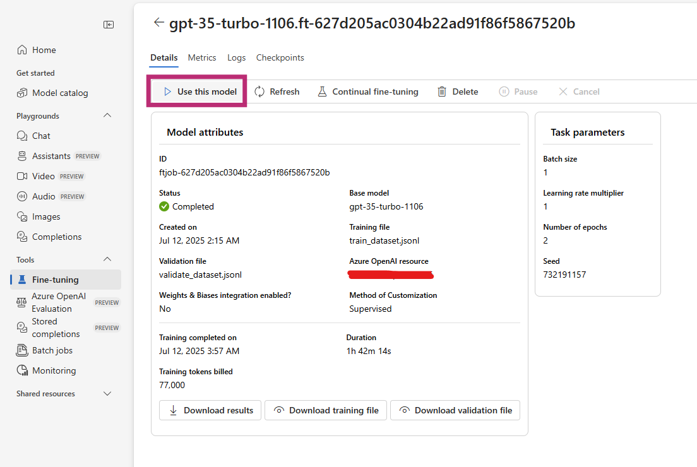
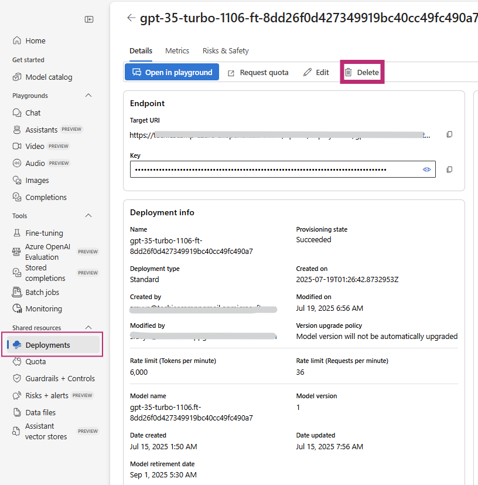

# Fine-Tuning using Azure OpenAI

Azure offers seamless way to customize model using fine-tuning technique. First one must know model avaliabilty and cost requirements based on their region.

In this project, I am using `GPT-3.5-turbo` as base model for fine-tuning.

## Folder Structure

```bash
mlops/
└── fine_tuning/
    ├── data/
    │   ├── raw/
    │   │   ├── dataset.jsonl
    │   │   ├── train_dataset.jsonl
    │   │   └── validate_dataset.jsonl
    │   └── processed/
    │       ├── updated_dataset.jsonl
    │       ├── updated_train_dataset.jsonl
    │       └── updated_validate_dataset.jsonl

    ├── logs/
    │   ├── events/
    │   │   └── ft_event_<job_id>.json
    │   └── checkpoints/
    │       └── ft_checkpoint_<job_id>.json

    ├── jobs/
    │   ├── continue_ft.py        # Resume training from checkpoint
    │   ├── find_checkpoint.py    # Locate last checkpoint
    │   └── find_events.py        # Extract event logs (training info)

    |── utils/
    │   ├── token_counter.py      # Token analysis for cost analysis
    ├── index.py                  # main source of 
    ├── tests/

    ├── .env
    ├── requirements.txt
    └── README.md

```

## Implementation of Fine-Tuning Model

Clone the git repository

```bash
git clone https://github.com/techiescamp/mlops.git
```

Go to project directory

```bash
cd mlops/fine-tuning
```

Create virtual enviornment

```bash
source venv/Scripts/activate

# for powershell
venv/Scripts/activate
```

### Environment Variables

Make sure to change environment variables in `.env.example` according to your mdoel requirements

```python
AZURE_ENDPOINT=<http://your-azure-resource>
AZURE_API_KEY=<your-api-key-from-azure>

AZURE_CHAT_DEPLOYMENT=<gpt-model>
MODEL_API_VERSION=<gpt-model-version-date-on-azure>

AZURE_EMBEDDING_DEPLOYMENT=<text-embedding-model-model>
AZURE_EMBEDDING_VERSION=<text-embedding-model-version-date-on-azure>
```

### Install dependencies

```bash
pip install -r requirements.txt
```

Run the main file code - [index.py](./index.py)

```bash
python index.py
```

### Track list of events

To track events of model, run the code after training the model is "succeeded"

[jobs/find_events.py](./jobs/find_events.py)

```bash
cd jobs
```

```bash
C:/User/projects/mlops/fine-tuning/jobs> python find_events.py
```

### Managing Checkpoints

To track checkpoints of the model,

[jobs/find_checkpoints.py](./jobs/find_checkpoint.py)

```bash
C:/User/projects/mlops/fine-tuning/jobs> python find_checkpoint.py
```

### For continous fine-tuning model

The process is same as `index.py` but model ame will change. Model name will be the fine-tuned model you have done previously.

[jobs/continue_ft.py](./jobs/continue_ft.py)

```bash
C:/User/projects/mlops/fine-tuning/jobs> python continue_ft.py
```

### Analyze the model

Azure provides `result.csv` file, which contains the analysis of the model.

[analysis/analyze_model.py](./analysis/analyze_model.py)

```bash
cd analysis

C:/User/projects/mlops/fine-tuning/analysis> python analyze_model.py
```

### Deploy Model

After training the model, deploy model by navigating to "Deployments", and click your model. Then click "use this model" button for deployment.



### Test model

For testing the model, [tests/test_model.py](./tests/test_model.py)

```bash
cd tests/

C:/User/projects/mlops/fine-tuning/tests> python test_model.py
```

### Delete deployment

If model is not required it is strongly recommended to delete the deployment. Because Azure OpenAI cost an hourly hosting.



## Contribution
-----
We welcome contributions from the security community. Please read our [Contributing Guidelines](../CONTRIBUTION.md) before submitting pull requests.


## License
This project is licensed under the [MIT License](../LICENCE). See the  file for details


